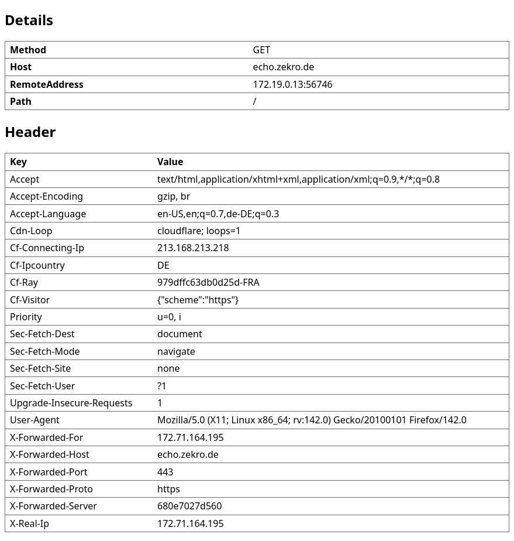

# echo

A server responding with the request details used for debugging HTTP clients or reverse proxies.

## Demo

```
docker run --rm --name echo --publish 8080:80 --detach ghcr.io/zekrotja/echo --verbosity detailed
curl http://localhost:8080 -X POST -H "Content-Type: application/json" -d '{"foo":"bar"}'
```

```json
{
  "method": "POST",
  "host": "localhost:8080",
  "headers": {
    "Accept": ["*/*"],
    "Content-Length": ["13"],
    "Content-Type": ["application/json"],
    "User-Agent": ["curl/8.11.1"]
  },
  "body_string": "{\"foo\":\"bar\"}",
  "body_parsed": {
    "foo": "bar"
  },
  "remote_address": "172.25.0.1:57722",
  "path": "/"
}
```

When you set the `Accept` header to `text/html`, the server will respond with a HTML page instead of JSON, which can be quite practical when accessing the server from a browser.


